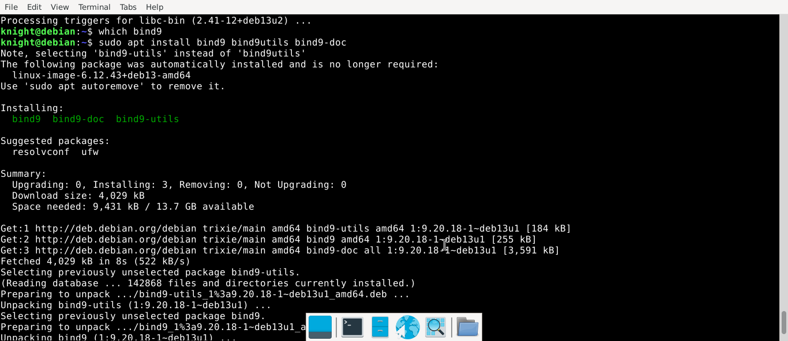
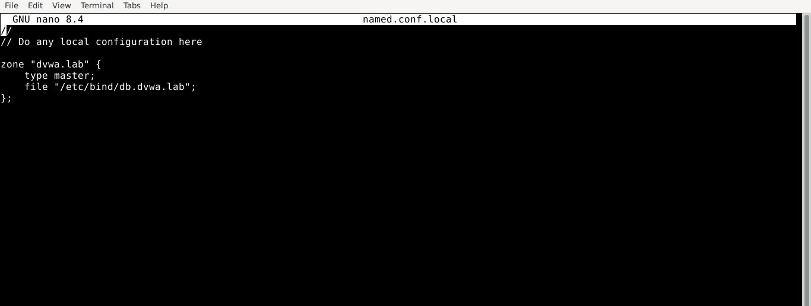
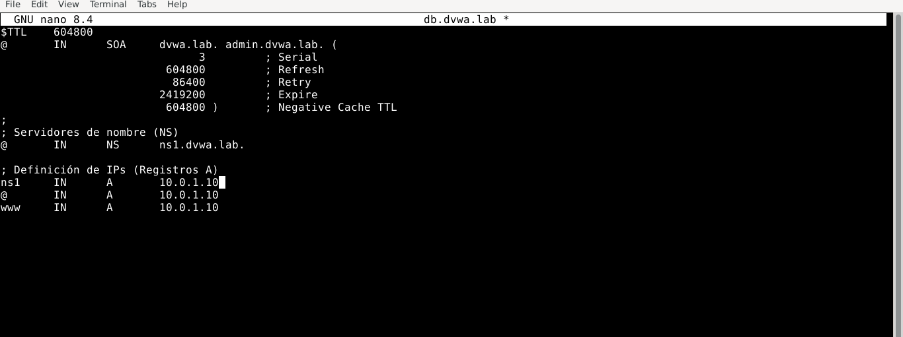
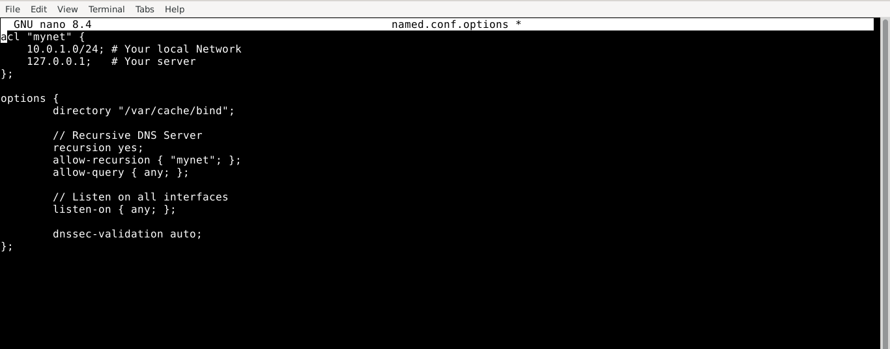
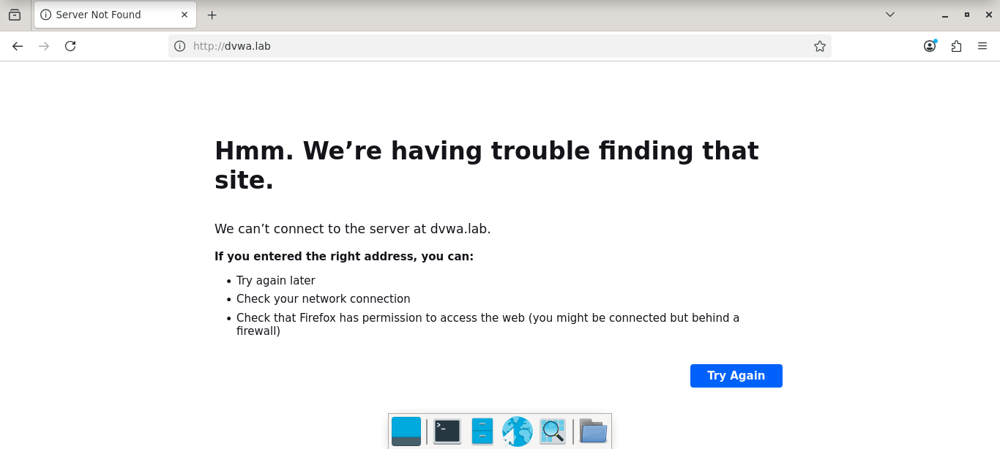
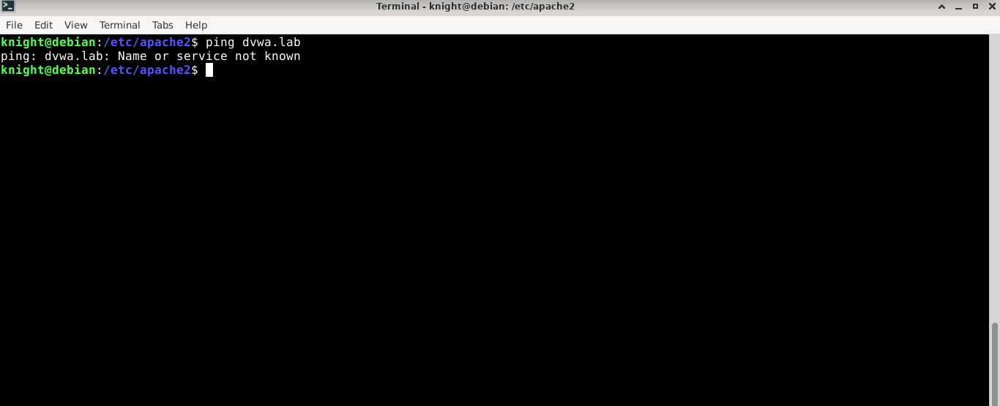
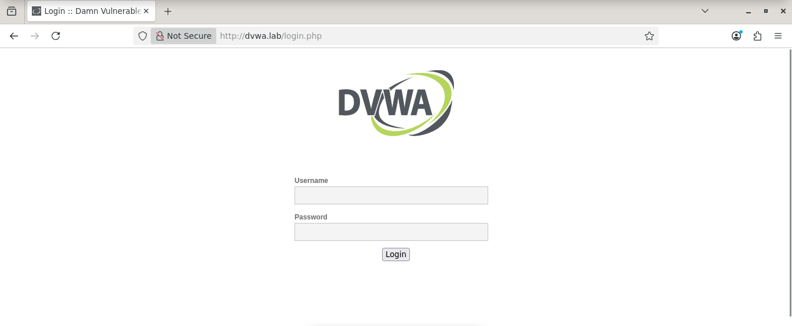

# 05 DNS Configuration Lab

---

## Setting up my DNS server

First, download and install bind9:

```bash
  sudo apt install bind9 bind9utils bind9-doc
```



After the installation, the first step is to create a zone in the local zone file `/etc/bind/named.conf.local`. This file contains information about every local domain zone. A domain zone is a directory that holds all the information about a single domain.



Every domain zone has its own file, so after creating the zone we create the actual zone file as follows:

```bash
  # Create the zone file using the default template
  # Convention: /etc/bind/db.{your_domain_name}
  sudo cp /etc/bind/db.local /etc/bind/db.dvwa.lab
```



This zone file acts as the directory of our domain, the server check this file to translate domain names into IP addresses and to find additional information about the domain.

After that, we configure the server options in `/etc/bind/named.conf.options`. Here we can define an access control list to restrict which devices are allowed to use our DNS server.



Once the files and options are configured, we verify the syntax with the following commands:

```bash
  sudo named-checkconf
  sudo named-checkzone dvwa.lab /etc/bind/db.dvwa.lab
```

Once everything is okay, we have to restart the DNS service as follow:

```bash
  sudo systemctl restart bind9
```

Finally, If you want that any client has access to your dns server, you have to configure your DNS Server as primary in its Network configurations. In linux you can modify the file `/etc/resolv.conf`, keep in mind this change is temporary and will reset after a reboot:

```bash
  # nameserver {your_server_ip_address}
  nameserver 10.0.1.10
```

---

## What errors I faced and how do I solved them

I was ready to test my DNS server, but when I entered `http://dvwa.local` in the browser it returned a `Server Not Found` error. `ping` also failed to resolve the domain.





After searching through Google, the BIND documentation, and the DVWA repository, I found that I also needed to configure the web server to handle incoming connections, so I set up a virtual host to redirect any request on that port to the DVWA site.

After that I kept receiving the same errors, so I tried adding a manual entry to `/etc/hosts`:

```bash
  sudo nano /etc/hosts

  # Add this line:
  10.0.1.10 dvwa.local
```

That worked — I could finally see the DVWA page in my browser. This confirmed my DNS server was running correctly, and `nslookup` also resolved the domain successfully.

So the problem was not the DNS server itself, it was the resolution order on my machine. I found this is controlled by `/etc/nsswitch.conf`:

```bash
hosts: files mdns4_minimal [NOTFOUND=return] dns
```

My system was checking in this order: `/etc/hosts` → `Multicast DNS (mdns4_minimal)` → `My DNS Server`

The issue was that `.local` is a reserved domain for Multicast DNS. So when my system sent the query to `mdns4_minimal` and got no response, the `[NOTFOUND=return]` directive told it to stop immediately — my DNS server was never reached.

I had two options: change the resolution order in `nsswitch.conf`, or rename my domain. I went with renaming it from `dvwa.local` to `dvwa.lab`, which solved the problem cleanly.


